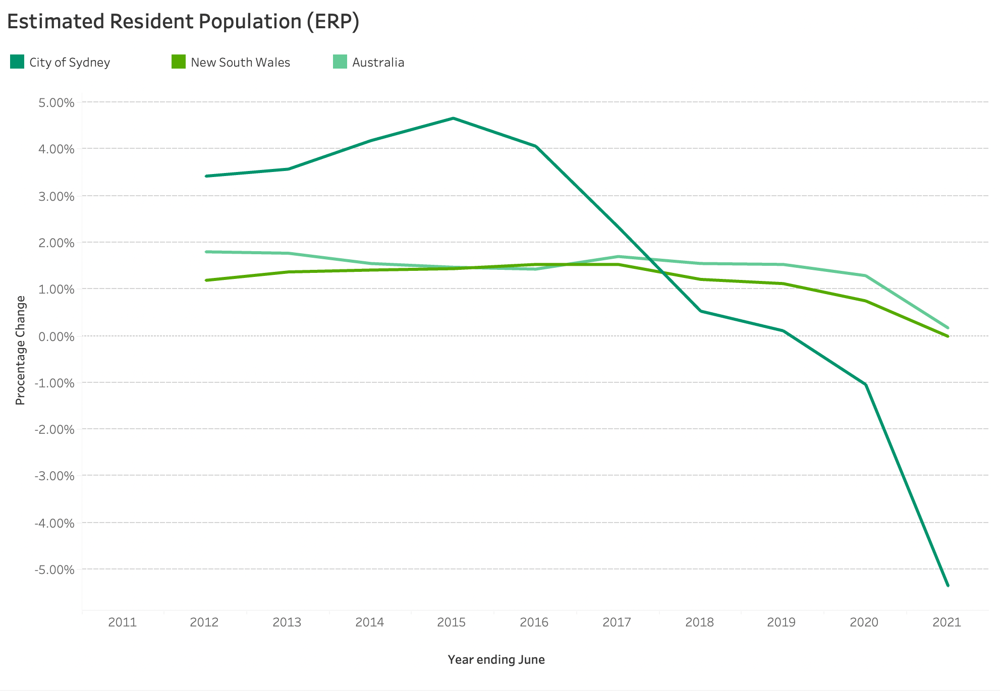

This line graph illustrates the annual change in Sydney's Estimated Resident Population (ERP) from 2011 to 2021.

This is compared to the annual change in New South Wales and Australia during the same time frame. Clearly, Sydney's projected resident population has decreased dramatically over the last two years.